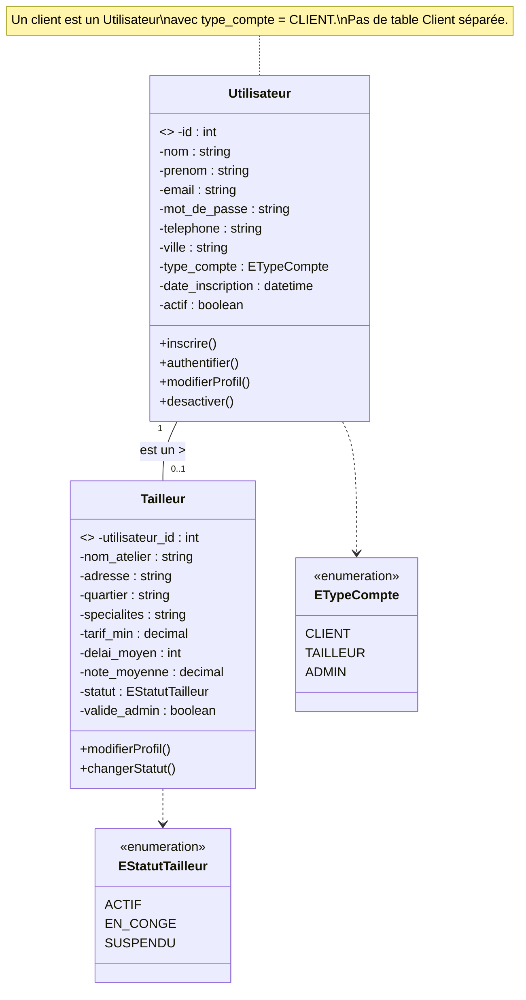
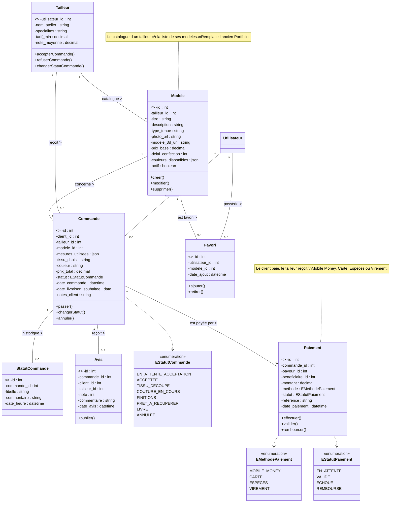
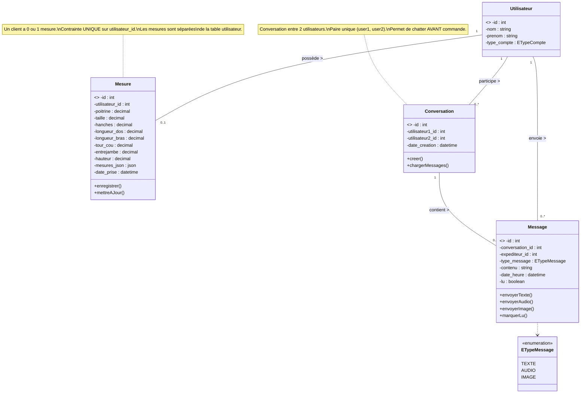
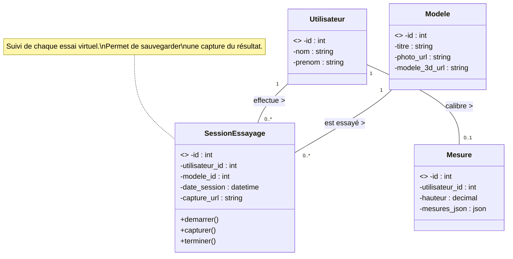
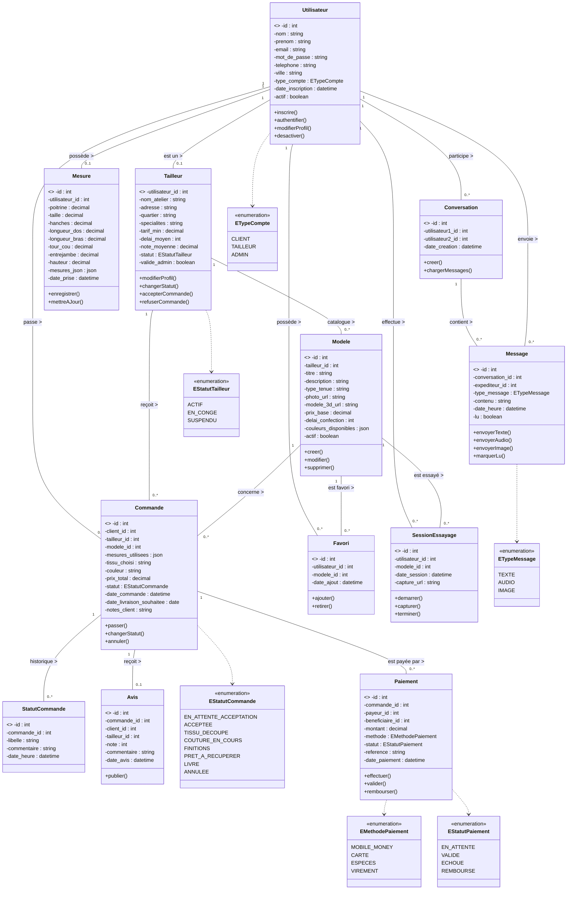

# Diagrammes de Classes d'Application — FITMOD v2

Modélisation orientée objet de la plateforme FITMOD, structurée par sprint.  
Les classes sont fidèles à la base de données `fitmod_bd_v2.sql`.  
Aucune méthode `get` / `set` n'est utilisée.

**Changements v1 → v2 :**
- Suppression table `Client` (un client = un `Utilisateur` avec `type_compte='client'`)
- Suppression table `Portfolio` (le catalogue = les `Modele` du tailleur)
- `Tailleur` : plus de double identifiant → `utilisateur_id` est la PK
- Nouvelle table `Mesure` (séparée, 0..1 par client)
- Nouvelle table `Conversation` + `Message` refait (chat libre)
- `Avis` / `Favori` liés à `utilisateur.id` directement

---

## 6.2.1 Diagramme de classes d'application du Sprint 1

Ce sprint permet de gérer l'inscription, la connexion et la gestion des comptes utilisateurs.

---

## 6.2.2 Diagramme de classes d'application du Sprint 2

Ce sprint met en place le catalogue de modèles, la recherche, le cycle de vie des commandes, les avis et les favoris.

---

## 6.2.3 Diagramme de classes d'application du Sprint 3

Ce sprint couvre la prise de mesures automatique par IA (webcam + MediaPipe) et le système de messagerie entre utilisateurs.

---

## 6.2.4 Diagramme de classes d'application du Sprint 4

Ce sprint intègre la cabine d'essayage virtuelle (rendu 3D + AR).

---

## 6.2.5 Diagramme de classes global (toutes les classes)

